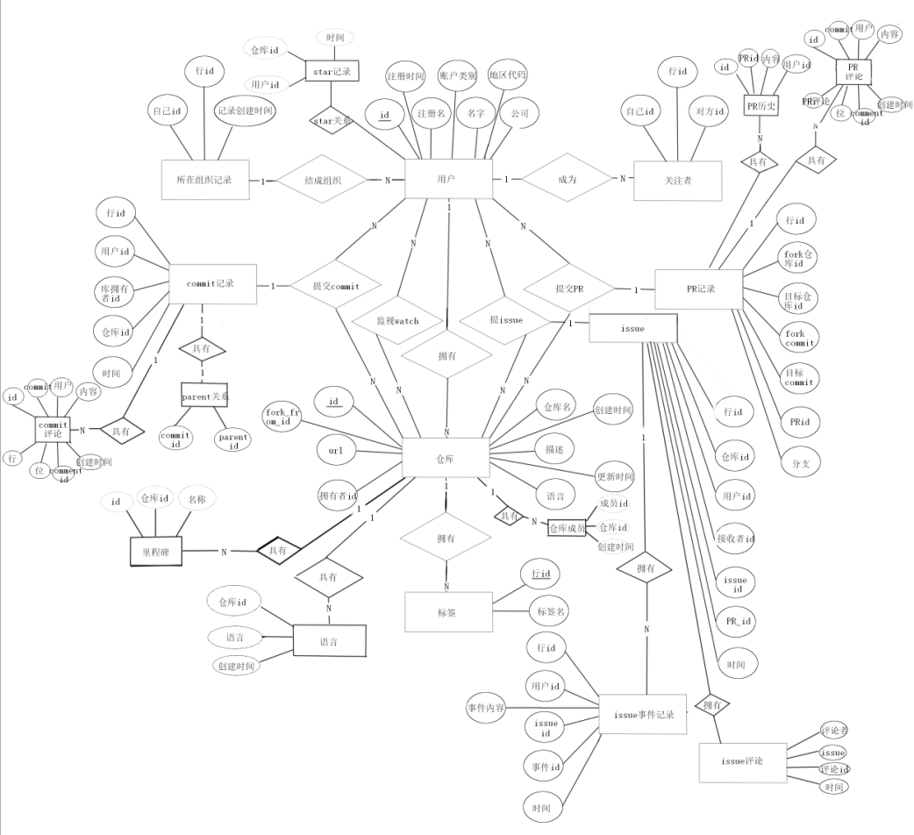

# github数据库设计

## 需求描述

需求概括：利用网络爬虫技术抓取 github.org数据，设计相应的本地数据库

需求细节：

1. 需要实现仓库信息的存储，包括仓库地址，所有者/组织，语言，参与贡献的成员，贡献（commit），issue，pull_request;
2. 需要实现用户信息的存储，包括用户名称，邮箱，创建的仓库，参与的组织，收藏的仓库(star_at),监视的仓库(watch),地区，注册时间等；
3. 需要实现存储过程供后台查询数据时调用，包括：
   1. 查询一天、一星期、一个月内新增的仓库数；
   2. 查询用户仓库，按获得的star降序排序；
   3. 查询特定语言的仓库获得，按获得的star降序排序；
   4. 查询本日/周/月新增仓库与上一日/周/月新增仓库的变化值；
   5. 查询用户，按照获得star的数量降序排序
4. 需要实现前端用网页展示出3中的数据
5. 需要实现爬虫，爬取github上的数据。

## E-R图

## Schema定义

